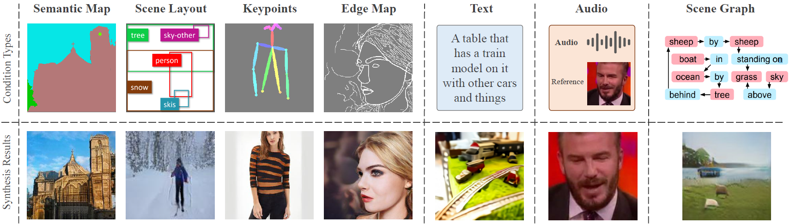

# Multimodal Image Synthesis and Editing: A Survey

 
 
 

<!--  -->
<!--  -->

<!-- ### TODO -->
<!-- - MISE Dataset for multimodel image synthesis and editing -->

## Table of Contents

- [Survey](#survey) 
- [Papers](#papers)
- [Talks](#talks)

## Survey
- [Neural Volume Rendering: NeRF And Beyond](https://arxiv.org/abs/2101.05204), Dellaert and Yen-Chen, Arxiv 2020 | [blog](https://dellaert.github.io/NeRF/) | [github](https://raw.githubusercontent.com/yenchenlin/awesome-NeRF/main/NeRF-and-Beyond.bib) | [bibtex](https://github.com/yenchenlin/awesome-NeRF/blob/main/citations/nerf-survey.txt)

## Table of Contents

- [Transformer-based Methods](#transformer-based methods) 
- [Papers](#papers)
- [Talks](#talks)

## Transformer-based Methods

**NÜWA: Visual Synthesis Pre-training for Neural visUal World creAtion** 
*Chenfei Wu, Jian Liang, Lei Ji, Fan Yang, Yuejian Fang, Daxin Jiang, Nan Duan* 
arxiv 2021
[[Paper](https://arxiv.org/abs/2111.12417)] 
[[Code](https://github.com/microsoft/NUWA)] 
[[Video](https://youtu.be/C9CTnZJ9ZE0)]

**Taming Transformers for High-Resolution Image Synthesis** 
*Patrick Esser, Robin Rombach, Björn Ommer* 
CVPR 2021
[[Paper](https://openaccess.thecvf.com/content/CVPR2021/papers/Esser_Taming_Transformers_for_High-Resolution_Image_Synthesis_CVPR_2021_paper.pdf)] 
[[Code](https://github.com/CompVis/taming-transformers)] 
[[Project](https://compvis.github.io/taming-transformers/)]

**Zero-Shot Text-to-Image Generation** 
*Aditya Ramesh, Mikhail Pavlov, Gabriel Goh, Scott Gray, Chelsea Voss, Alec Radford, Mark Chen, Ilya Sutskever* 
arxiv 2021
[[Paper](https://arxiv.org/abs/2102.12092)]
[[Code](https://github.com/openai/DALL-E)]
[[Project](https://openai.com/blog/dall-e/)]

 

## NeRF-based Methods

**CLIP-NeRF: Text-and-Image Driven Manipulation of Neural Radiance Fields** 
*Can Wang, Menglei Chai, Mingming He, Dongdong Chen, Jing Liao* 
arxiv 2021
[[Paper](https://arxiv.org/abs/2112.05139)]
[[Code](https://github.com/cassiePython/CLIPNeRF)]
[[Project](https://cassiepython.github.io/clipnerf/)]

**AD-NeRF: Audio Driven Neural Radiance Fields for Talking Head Synthesis** 
*Yudong Guo, Keyu Chen, Sen Liang, Yong-Jin Liu, Hujun Bao, Juyong Zhang* 
ICCV 2021
[[Paper](https://openaccess.thecvf.com/content/ICCV2021/papers/Guo_AD-NeRF_Audio_Driven_Neural_Radiance_Fields_for_Talking_Head_Synthesis_ICCV_2021_paper.pdf)]
[[Code](https://github.com/YudongGuo/AD-NeRF)]
[[Project](https://yudongguo.github.io/ADNeRF/)]
[[Video](https://www.youtube.com/watch?v=TQO2EBYXLyU)]

 

## Diffusion-based Methods

**GLIDE: Towards Photorealistic Image Generation and Editing with Text-Guided Diffusion Models** 
*Alex Nichol, Prafulla Dhariwal, Aditya Ramesh, Pranav Shyam, Pamela Mishkin, Bob McGrew, Ilya Sutskever, Mark Chen* 
arxiv 2021
[[Paper](https://arxiv.org/abs/2112.10741)]
[[Code](https://github.com/openai/glide-text2im)]

**Vector Quantized Diffusion Model for Text-to-Image Synthesis** 
*Shuyang Gu, Dong Chen, Jianmin Bao, Fang Wen, Bo Zhang, Dongdong Chen, Lu Yuan, Baining Guo* 
arxiv 2021
[[Paper](https://arxiv.org/abs/2111.14822)]
[[Code](https://github.com/microsoft/VQ-Diffusion)]

**DiffusionCLIP: Text-Guided Diffusion Models for Robust Image Manipulation** 
*Gwanghyun Kim, Jong Chul Ye* 
arxiv 2021
[[Paper](https://arxiv.org/abs/2110.02711)]

**Blended Diffusion for Text-driven Editing of Natural Images** 
*Omri Avrahami, Dani Lischinski, Ohad Fried* 
arxiv 2021
[[Paper](https://arxiv.org/abs/2111.14818)]
[[Code](https://github.com/omriav/blended-diffusion)]

 

## GAN Inversion Methods 

**StyleCLIP: Text-Driven Manipulation of StyleGAN Imagery** 
*Or Patashnik, Zongze Wu, Eli Shechtman, Daniel Cohen-Or, Dani Lischinski* 
ICCV 2021
[[Paper](https://openaccess.thecvf.com/content/ICCV2021/papers/Patashnik_StyleCLIP_Text-Driven_Manipulation_of_StyleGAN_Imagery_ICCV_2021_paper.pdf)]
[[Code](https://github.com/orpatashnik/StyleCLIP)]
[[Video](https://www.youtube.com/watch?v=PhR1gpXDu0w)]

**Talk-to-Edit: Fine-Grained Facial Editing via Dialog** 
*Yuming Jiang, Ziqi Huang, Xingang Pan, Chen Change Loy, Ziwei Liu* 
ICCV 2021
[[Paper](https://openaccess.thecvf.com/content/ICCV2021/papers/Jiang_Talk-To-Edit_Fine-Grained_Facial_Editing_via_Dialog_ICCV_2021_paper.pdf)]
[[Code](https://github.com/yumingj/Talk-to-Edit)]
[[Project](https://www.mmlab-ntu.com/project/talkedit/)]

**TediGAN: Text-Guided Diverse Face Image Generation and Manipulation** 
*Weihao Xia, Yujiu Yang, Jing-Hao Xue, Baoyuan Wu* 
CVPR 2021
[[Paper](https://openaccess.thecvf.com/content/CVPR2021/papers/Xia_TediGAN_Text-Guided_Diverse_Face_Image_Generation_and_Manipulation_CVPR_2021_paper.pdf)]
[[Code](https://github.com/IIGROUP/TediGAN)]
[[Video](https://www.youtube.com/watch?v=L8Na2f5viAM)]

 

## GAN-based Methods

**Audio-Driven Emotional Video Portraits** 
*Xinya Ji, Hang Zhou, Kaisiyuan Wang, Wayne Wu, Chen Change Loy, Xun Cao, Feng Xu* 
CVPR 2021
[[Paper](https://arxiv.org/abs/2104.07452)]
[[Code](https://github.com/jixinya/EVP/)]
[[Project](https://jixinya.github.io/projects/evp/)]

**MirrorGAN: Learning Text-to-image Generation by Redescription** 
*Tingting Qiao, Jing Zhang, Duanqing Xu, Dacheng Tao* 
CVPR 2019
[[Paper](https://arxiv.org/abs/1903.05854)]
[[Code](https://github.com/qiaott/MirrorGAN)]

**AttnGAN: Fine-Grained Text to Image Generation with Attentional Generative Adversarial Networks** 
*Tao Xu, Pengchuan Zhang, Qiuyuan Huang, Han Zhang, Zhe Gan, Xiaolei Huang, Xiaodong He* 
CVPR 2018
[[Paper](https://openaccess.thecvf.com/content_cvpr_2018/papers/Xu_AttnGAN_Fine-Grained_Text_CVPR_2018_paper.pdf)]
[[Code](https://github.com/taoxugit/AttnGAN)]

**Plug & Play Generative Networks: Conditional Iterative Generation of Images in Latent Space** 
*Anh Nguyen, Jeff Clune, Yoshua Bengio, Alexey Dosovitskiy, Jason Yosinski* 
CVPR 2017
[[Paper](https://openaccess.thecvf.com/content_cvpr_2017/papers/Nguyen_Plug__Play_CVPR_2017_paper.pdf)]
[[Code](https://github.com/Evolving-AI-Lab/ppgn)]

**StackGAN++: Realistic Image Synthesis with Stacked Generative Adversarial Networks** 
*Han Zhang, Tao Xu, Hongsheng Li, Shaoting Zhang, Xiaogang Wang, Xiaolei Huang, Dimitris Metaxas* 
TPAMI 2018
[[Paper](https://arxiv.org/abs/1710.10916)]
[[Code](https://github.com/hanzhanggit/StackGAN-v2)]

**StackGAN: Text to Photo-realistic Image Synthesis with Stacked Generative Adversarial Networks** 
*Han Zhang, Tao Xu, Hongsheng Li, Shaoting Zhang, Xiaogang Wang, Xiaolei Huang, Dimitris Metaxas* 
ICCV 2017
[[Paper](https://arxiv.org/abs/1612.03242)]
[[Code](https://github.com/hanzhanggit/StackGAN)]

 

## Other Methods

**Language-Driven Image Style Transfer** 
*Tsu-Jui Fu, Xin Eric Wang, William Yang Wang* 
arxiv 2021
[[Paper](https://arxiv.org/abs/2106.00178)]

**CLIPstyler: Image Style Transfer with a Single Text Condition** 
*Gihyun Kwon, Jong Chul Ye* 
arxiv 2021
[[Paper](https://arxiv.org/abs/2112.00374)]
[[Code](https://github.com/paper11667/CLIPstyler)]
